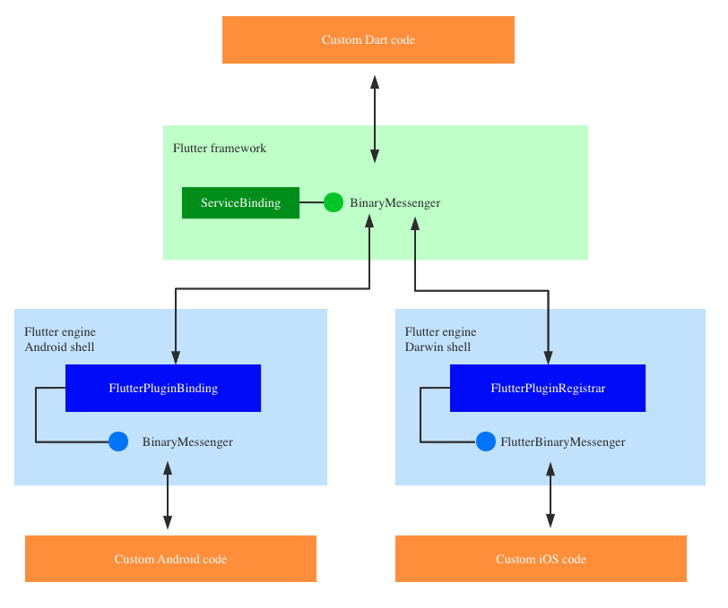

#  Flutter Channel

Flutter 做为一个跨平台的 UI 框架，免不了要跟所运行的平台发生交互。尤其是在移动端平台上，有些功能是离不开平台能力的，例如：

- notifications, app lifecycle, deep links, …
- sensors, camera, battery, geolocation, sound, connectivity, …
- sharing information with other apps, launching other apps, …
- persisted preferences, …

Flutter 选择使用 Platform Channel 的方式来实现 Flutter 和 Platform 的互相操作。

## BinaryMessenger

BinaryMessenger 是 Flutter  Platform Channel 的基础。

BinaryMessenger 可以在 Flutter 和 Platform 之前传递 binary data，在此基础上，就可以实现 Flutter 和 Platform 的通信。

 

BinaryMessenger 的功能比较显而易见，就是发送和接受 ByteData：

````dart
Future<ByteData?>? send(String channel, ByteData? message);
void setMessageHandler(String channel, MessageHandler? handler);
typedef MessageHandler = Future<ByteData?>? Function(ByteData? message);
````

### 使用 BinaryMessenger 通信

在 Dart 侧，用 BinaryMessenger 往 Platform 侧发送消息：

```dart
final reply = await ServicesBinding.instance.defaultBinaryMessenger.send(
  'foo',
  (WriteBuffer()
        ..putFloat64(6.9)
        ..putInt32(69))
      .done(),
);
```

在 Platform 侧

```kotlin
flutterPluginBinding.binaryMessenger.setMessageHandler("foo") { byteBuffer, binaryReply ->
      print("receiveInt=${byteBuffer?.int}, receiveDouble=${byteBuffer?.double}")
      val reply = ByteBuffer.allocate(20)
      reply.putInt(58)
      reply.putDouble(5.8)
      binaryReply.reply(reply)
    }
```

或

```swift
    registrar.messenger().setMessageHandlerOnChannel("foo") { (data, flutterBinaryReply) in
      /// process receipt and/or reply
    }
```

可以看出，Flutter 设计的通信方式是非常简单的，就是 Dart 侧和 Platform 通过各自的 BinaryMessenger 发送 binary data。

### BinaryMessenger 的实现

下面看下 BinaryMessenger 的实现，主要关注三个方面：

1. 如何发送消息，即 send 的实现；
2. 如何接受另一侧传递过来的消息；
3. 如何处理另一侧传递过来的消息，即如何把接收到的另一侧的消息分发给 handler，即 setMessageHandler 的实现。

#### Dart 侧的 BinaryMessenger

Dart 侧的 BinaryMessenger 的默认实现在 ServiceBinding 中

##### 发送消息

```dart
@override
Future<ByteData?>? send(String channel, ByteData? message) {
  final MessageHandler? handler = _mockHandlers[channel];
  if (handler != null)
    return handler(message);
  return _sendPlatformMessage(channel, message);
}
Future<ByteData?> _sendPlatformMessage(String channel, ByteData? message) {
    final Completer<ByteData?> completer = Completer<ByteData?>();
    ui.PlatformDispatcher.instance.sendPlatformMessage(channel, message, (ByteData? reply) {
      try {
        completer.complete(reply);
      } catch (exception, stack) {}
    });
    return completer.future;
  }

	/// PlatformDispatcher
  void sendPlatformMessage(String name, ByteData? data, PlatformMessageResponseCallback? callback) {
    final String? error =
        _sendPlatformMessage(name, _zonedPlatformMessageResponseCallback(callback), data);
  }
	/// 最终是通过 Native Extension 实现的
  String? _sendPlatformMessage(String name, PlatformMessageResponseCallback? callback, ByteData? data)
      native 'PlatformConfiguration_sendPlatformMessage';
```

### asynchronous

从上面的 BinaryMessenger 的实现可以看出，使用 BinaryMessenger 发送消息是异步的：消息发出后任务就结束了，另一侧如何处理消息是不会阻塞发送消息的操作的。

## Native Extension

### References

* [Native extensions for the standalone Dart VM](https://dart.dev/server/c-interop-native-extensions)
* [Sample](https://github.com/dart-lang/sdk/tree/master/samples/sample_extension)

* [flutter issues 2396](https://github.com/flutter/flutter/issues/2396)

跟踪 Flutter Framework 代码的时候，经常会遇到类似这样的带 native 关键字的代码：

```dart
  String? _sendPlatformMessage(String name, PlatformMessageResponseCallback? callback, ByteData? data)
      native 'PlatformConfiguration_sendPlatformMessage';
```

这里的 native 关键字表明这个函数的最终实现是一个 native 的实现。

做为一个完备的高级语言，dart 当然也支持跟 native 代码的交互。这里的 native 关键字就是 Dart 跟 native 交互的方式之一：Native Extension。

在开始介绍 Native Extension 之前，先明确下 Native Extension 的用途和局限性：

<table bgColor=#EAF7FE>
  <tr>
    <td >
      <ul>
        <li>
          Dart 和 Flutter Engine 中大量使用了 Native Extension 来实现Dart 跟 Native的交互
        </li>
        <li>
          Native Extension 只能用在 standalone Dart VM (command-line apps)          
        </li>
        <li>
          使用 C/C++ 库更通用的方法是 ffi
        </li>
      </ul>
    </td>
  </tr>
</table>


### Synchronous，Asynchronous

Native Extension 有两种：Synchronous 和 Asynchronous。Synchronous 的 Native Extension 会直接在当前线程中执行 Native 的代码逻辑；Asynchronous 的  Native Extension 会由 VM 新起一个线程来执行  Native 的代码逻辑。

> **Synchronous**

Synchronous 的  Native Extension 比较简单，在 Dart 中用 Native 关键字声明 Native 的接口名字即可：

```dart
String? _sendPlatformMessage(String name, PlatformMessageResponseCallback? callback, ByteData? data)
    native 'PlatformConfiguration_sendPlatformMessage';
```

相应的，在 Native 层有接口的具体实现：

```c++
Dart_Handle SendPlatformMessage(Dart_Handle window,
                                const std::string& name,
                                Dart_Handle callback,
                                Dart_Handle data_handle) {
  UIDartState* dart_state = UIDartState::Current();

  if (!dart_state->platform_configuration()) {
    return tonic::ToDart(
        "Platform messages can only be sent from the main isolate");
  }

  fml::RefPtr<PlatformMessageResponse> response;
  if (!Dart_IsNull(callback)) {
    response = fml::MakeRefCounted<PlatformMessageResponseDart>(
        tonic::DartPersistentValue(dart_state, callback),
        dart_state->GetTaskRunners().GetUITaskRunner());
  }
  if (Dart_IsNull(data_handle)) {
    dart_state->platform_configuration()->client()->HandlePlatformMessage(
        fml::MakeRefCounted<PlatformMessage>(name, response));
  } else {
    tonic::DartByteData data(data_handle);
    const uint8_t* buffer = static_cast<const uint8_t*>(data.data());
    dart_state->platform_configuration()->client()->HandlePlatformMessage(
        fml::MakeRefCounted<PlatformMessage>(
            name, std::vector<uint8_t>(buffer, buffer + data.length_in_bytes()),
            response));
  }

  return Dart_Null();
}
```

> **Asynchronous**

Asynchronous Native Extension 是通过 ReceivePort 和 SendPort 来实现的。

在 Dart 端，用 Synchronous 的方式找 Natvie 端要一个 SendPort 用以发送消息。

使用 SendPort 发送消息给 Native 的时候，可以同时把 ReceivePort 传递过去，用以接受从 Native 返回的数据：

```dart
  SendPort get _servicePort {
    if (_port == null) {
      _port = _newServicePort();
    }
    return _port!;
  }

  SendPort _newServicePort() native "RandomArray_ServicePort";

  Future<List<int>> randomArray(int seed, int length) {
    var completer = new Completer<List<int>>();
    var replyPort = new RawReceivePort();
    var args = [seed, length, replyPort.sendPort];
    _servicePort.send(args);
    replyPort.handler = (result) {
      replyPort.close();
      if (result != null) {
        completer.complete(result);
      } else {
        completer.completeError(new Exception("Random array creation failed"));
      }
    };
    return completer.future;
  }
```

在 Native 端，提供 Dart 端需要的 SendPort，以及处理发送过来的消息：

```cpp
void randomArrayServicePort(Dart_NativeArguments arguments) {
  Dart_EnterScope();
  Dart_SetReturnValue(arguments, Dart_Null());
  Dart_Port service_port =
      Dart_NewNativePort("RandomArrayService", wrappedRandomArray, true);
  if (service_port != ILLEGAL_PORT) {
    Dart_Handle send_port = HandleError(Dart_NewSendPort(service_port));
    Dart_SetReturnValue(arguments, send_port);
  }
  Dart_ExitScope();
}

void wrappedRandomArray(Dart_Port dest_port_id,
                        Dart_CObject* message) {
  Dart_Port reply_port_id = ILLEGAL_PORT;
  if (message->type == Dart_CObject_kArray &&
      3 == message->value.as_array.length) {
    // Use .as_array and .as_int32 to access the data in the Dart_CObject.
    Dart_CObject* param0 = message->value.as_array.values[0];
    Dart_CObject* param1 = message->value.as_array.values[1];
    Dart_CObject* param2 = message->value.as_array.values[2];
    if (param0->type == Dart_CObject_kInt32 &&
        param1->type == Dart_CObject_kInt32 &&
        param2->type == Dart_CObject_kSendPort) {
      int seed = param0->value.as_int32;
      int length = param1->value.as_int32;
      reply_port_id = param2->value.as_send_port.id;
      uint8_t* values = randomArray(seed, length);

      if (values != NULL) {
        Dart_CObject result;
        result.type = Dart_CObject_kTypedData;
        result.value.as_typed_data.type = Dart_TypedData_kUint8;
        result.value.as_typed_data.values = values;
        result.value.as_typed_data.length = length;
        if (Dart_PostCObject(reply_port_id, &result)) {
          Dart_CObject error;
          error.type = Dart_CObject_kNull;
          Dart_PostCObject(reply_port_id, &error);
        }
        free(values);
        // It is OK that result is destroyed when function exits.
        // Dart_PostCObject has copied its data.
        return;
      }
    }
  }
  fprintf(stderr, "Invalid message received, cannot proceed. Aborting the process.\n");
  abort();
}
```

### Custom Native Extension

Custom Native Extension 只能用在 standalone 的 DartVM 中，也就是 command line 的 dart 程序中。

#### Dart

```dart
import 'dart-ext:sample_extension';
int systemRand() native "SystemRand";
```

#### Native

```c++
// 初始化，对应的是 libsample_extension.so 或 .dylib
DART_EXPORT Dart_Handle sample_extension_Init(Dart_Handle parent_library) {
  Dart_Handle result_code =
      Dart_SetNativeResolver(parent_library, ResolveName, NULL);
  if (Dart_IsError(result_code)) {
    return result_code;
  }
  return Dart_Null();
}


Dart_Handle HandleError(Dart_Handle handle) {
  if (Dart_IsError(handle)) {
    Dart_PropagateError(handle);
  }
  return handle;
}


void SystemRand(Dart_NativeArguments arguments) {
  Dart_EnterScope();
  Dart_Handle result = HandleError(Dart_NewInteger(rand()));
  Dart_SetReturnValue(arguments, result);
  Dart_ExitScope();
}

/// 接口匹配
Dart_NativeFunction ResolveName(Dart_Handle name,
                                int argc,
                                bool* auto_setup_scope) {
  
  Dart_NativeFunction result = NULL;
  Dart_EnterScope();
  const char* cname;
  HandleError(Dart_StringToCString(name, &cname));

  for (int i=0; function_list[i].name != NULL; ++i) {
    if (strcmp(function_list[i].name, cname) == 0) {
      *auto_setup_scope = true;
      result = function_list[i].function;
      break;
    }
  }
  Dart_ExitScope();
  return result;
}

FunctionLookup function_list[] = {
    {"SystemRand", SystemRand},
    {"SystemSrand", SystemSrand},
    {"RandomArray_ServicePort", randomArrayServicePort},
    {NULL, NULL}};
```


#### 接口匹配

自定义的 Native Extension 还需要自己处理符号的匹配，每个 Native 的 Library 都应该定义自己的 ResolveName 接口，在这里路由 Dart 传递过来的调用。

#### [实现原理](https://github.com/dart-lang/sdk/blob/1e5eab3a143f0736d925f546952006fb31127e9a/runtime/bin/dartutils.cc#L445)

在碰到以 dart-ext: 开头的 uri 的 improt 时，会这个 uri 转变成一个 native  层的 dlopen 调用，把对应的 native 库加载进来。然后调用的库的 init 函数。

后续在 dart 中碰到 native 调用时，就会通过 native 库的 ResolveName 解析对应的 natvie 层的函数。

## Message Channel

BinaryMessenger 是 Flutter 跟 Platform 通信的基础，但是直接使用 BinaryMessenger 手动处理 byte data 显然不是一个好的选择。

在实际的使用场景中，我们需要发送和接收的往往都是对象，用一个 Message Codec 来实现 byte data 跟 对象的转换就可以不用直接处理 byte data 了。

Flutter 提供了 Message Channel 来实现这个功能，大体上 Message Channel 相当于 **BinaryMessenger + Message Codec**：

在 Dart 端，Message Codec 叫 MessageCodec：

```dart
abstract class MessageCodec<T> {
  ByteData? encodeMessage(T message);
  T decodeMessage(ByteData? message);
}
```

有了 Message Codec，MessageChannel 的实现就简单了：

```dart
class BasicMessageChannel<T> {
  const BasicMessageChannel(this.name, this.codec, { BinaryMessenger? binaryMessenger })
  // 发送消息
  Future<T> send(T message) async {
    return codec.decodeMessage(await binaryMessenger.send(name, codec.encodeMessage(message)));
  }
  // 接收消息
  void setMessageHandler(Future<T> Function(T message)? handler) {
    binaryMessenger.setMessageHandler(name, (ByteData? message) async {
      return codec.encodeMessage(await handler(codec.decodeMessage(message)));
    });
  }
}
```

在 Platform 侧，Message Channel 实现几乎一致，不再赘述。

不难看出，Message Codec 是 Message Channel 的核心。

Message Codec 要实现对象的编解码，因此在 Dart 侧和 Platform 侧必须提供对等的 Message Codec 才能正常工作。

Flutter 提供了四种不同的 Message Codec：

- **BinaryCodec**：

  将 ByteData 转换成 ByteData

  BinaryCodec 主要是为了方便使用 Message Channel，并没有做任何实质的转换。

  

- **StringCodec**

  在 String 和 ByteData 之间进行转换。

  StringCodec 使用 UTF-8 实现 String 和 ByteData 的转换。

  

- **JSONMessageCodec**

  用 JSON 的方式在支持的类型和 ByteData 之间进行转换。

  encode 时，先把对象用 JSON 转换器转换成 String，然后再用 StringCodec 转换成 ByteData：

  ```dart
  ByteData? encodeMessage(dynamic message) {
    ...
    return const StringCodec().encodeMessage(json.encode(message));
  }
  ```

  decode 时同理。

  支持的数据类型由 JSON 转换器所确定，包括：

  - null
  - bools
  - nums
  - Strings
  - Lists of supported values
  - Maps from **strings** to supported values

  在 Dart 端 JSON 转换使用的是 dart.convert；

  在 Android 端 JSON 转换使用的是 org.json；

  在 iOS 端 JSON 转换使用的是 NSJSONSerialization。

  > 项目中的 xxxRequest 或 xxxResponse 对象都是可以被 dart.convert 进行 JSON 转换的，那么能不能直接使用 JSONMessageCodec 通过 MessageChannel 传递项目中的 xxxRequest 或 xxxResponse 对象到 Platform 侧？

  不可以：

  <table bgColor=#EAF7FE>
    <tr>
      <td >
        JSON 转换需要在 Dart 侧和 Platform 侧有对等的支持，xxxRequest 或 xxxResponse 对象只是在 Dart 侧通过 json_serializable 进行了普通对象的 JSON 转换，在 Platform 侧如果不做对等的处理，是不能通过 Message Channel 进行传递的。
        <br/> <br/>
        实际上，在 Platform 侧收到的是 JSONObject 对象，因此如果需要转换成具体的 model 对象，还需要做些额外的处理。
      </td>
    </tr>
  </table>


  JSON 的转换是比较低效且有一些局限性的。

  - 例如把一个 num 通过 JSONMessageCodec 进行传递，需要先把 num 转成成 String，再把 String 用 StringCodec 转换成 ByteData，然后在另一侧用对等的操作做想法的处理。显然转换成 String 的这个中间操作是没有必要的，理论上是可以直接把 num 转换成 ByteData 进行传递的；

  - 另一方面，JSON 还会增加一些额外的格式化信息，这些信息虽然带来了可读性，但是增加了内存占用，对机器而言是没有必要的；

  - 此外，JSONMessageCodec 的 Map 仅支持 String key，也带来了一定的局限性。

    

- **StandardMessageCodec**

  用自定义的格式在支持的类型和 ByteData 之间进行转换。

  encode 时，根据对象的类型，直接把对象写入到 ByteData 中。

  ```dart
  ByteData? encodeMessage(dynamic message) {
    ...
    final WriteBuffer buffer = WriteBuffer();
    writeValue(buffer, message);
    return buffer.done();
  }
  
  void writeValue(WriteBuffer buffer, dynamic value) {
      if (value == null) {
        buffer.putUint8(_valueNull);
      } else if (value is double) {
        // 写入文件类型
        buffer.putUint8(_valueFloat64);
        // 写入文件内容
        buffer.putFloat64(value);
      } 
      ...
  ```

  StandardMessageCodec 支持的数据类型包括

  - null
  - bools
  - nums
  - Strings
  - Uint8Lists, Int32Lists, Int64Lists, Float64Lists
  - Lists of supported values
  - Maps **from supported values** to supported values

  可以看出，StandardMessageCodec 直接把支持的数据类型写入到了 ByteData 中，更高效也更加节省内存。

  但是，StandardMessageCodec 只能传递这些数据类型，对于一些普通对象，是没法进行传递的。
  
  > 可以看出，Flutter 内置的这四种 Message Codec 实际上表达两种传递数据的思路：
  >
  > 一种思路是把要传递的内容转变成 String，然后再用 StringCodec 转变成 ByteData 进行传递；
  >
  > StringCodec 是这种思路的基础，它负责把 String 用 utf-8 的方式转变成 ByteData；至于如何把要传递的内容序列化成 String，就有多种选择了，简单的对象传递可以用 JSONMessageCodec，负责的自定义类的对象，可以用成熟的现有的序列化成 String 的方式，但前提是 Dart 侧和 Platform 都必须做对等的处理。
  >
  > 另一种思路是直接把要传递的数据写入到 ByteData 中然后进行传递，StandardMessageCodec就是这种思路。这种方式更高效、更节省内存，但如果想支持普通对象的传递，实现起来会比较繁琐。
  
  > 能不能用 Message Codec 做持久化？
  
  不能，Message Codec 是被设计用来进行 App 内部数据传递，他的具体实现依赖于 Flutter 的版本，有可能在 Flutter 版本升级的时候修改了 Codec 的实现逻辑，即同样的对象在不同版本的 Flutter 上 ByteData 的形式是不一样的。因此，如果用 Codec 做持久化可能不能兼容 Flutter 版本的变化。

### 泛型问题

Dart 虽然是强类型语言，但是默认允许隐式的类型强转 (downcast)，例如下面的代码时可以通过代码静态检查的：

```dart
Object o = ...
String s = o; // Implicit downcast
```

至于在运行时能否正常运行，则取决于对象 o 在**运行时的类型**，如果 o 在运行时的类型是 String，那么运行时是没有问题的。


回到 Message Channel 这个主题，如前面的定义，BasicMessageChannel 是支持泛型的，所  泛化的类型就是通过 channel 传递的对象的类型，也就是 Message Codec 所处理的类型。

Flutter 内置的 JSONMessageCodec 和 StandardMessageCodec 的泛化类型都是 dynamic，而具体传递的对象类型往往又是具体的，因此在使用时需要注意。

例如下面的代码，由于 Dart 默认允许 implicit downcast，所以都可以通过 analyzer 静态检查：

```dart
final String reply1 = await channel.send(msg1);				
final int reply2 = await channel.send(msg2);					
```

运行时，在 channel reply 的类型匹配的情况下（第一行 reply 的就是 String、第二行 reply 的就是 int），代码运行是没有问题的。

但是当牵扯到泛型的时候，情况就有点不同了：

```dart
final List<String> reply3 = await channel.send(msg3); 
final List<dynamic> reply3 = await channel.send(msg3);
```

上面的代码可以通过静态检查，但是第一行在运行时却会报错（除非 reply 为 null），哪怕 reply 的的确是 List<String>。

这是因为，如果 reply 的是 List，那么其**运行时类型**为 List<dynamic>，List<dynamic> 是无法被 downcast 成 List<String> 的。

```dart
/// StandardMessageCodec
case _valueList:
  final int length = readSize(buffer);
  final List<dynamic> result = List<dynamic>.filled(length, null, growable: false);
  for (int i = 0; i < length; i++)
    result[i] = readValue(buffer);
  return result;
```

几乎同样的道理，下面代码虽然可以通过静态检查，但是第一行在运行时会报错（除非 reply 为 null），哪怕 reply 的的确是 String：

```dart
Future<String> greet() => channel.send('hello, world');    // Fails.
Future<String> greet() async {                             // Works.
  final String reply = await channel.send('hello, world');
  return reply;
}
```

这是因为 channel.send 的返回值的**运行时类型**为 Future<dynamic>，而 Future<dynamic> 无法被 downcast 成 Future<String>。

```dart
Future<T> send(T message) async {
  return codec.decodeMessage(await binaryMessenger.send(name, codec.encodeMessage(message)));
}

/// StandardMessageCodec
@override
dynamic decodeMessage(ByteData? message) {
  ...
  final dynamic result = readValue(buffer);
  ...
  return result;
}
```

> 可以通过 analysis options [关闭 implicit downcast](https://dart.dev/guides/language/analysis-options#enabling-additional-type-checks)

## Method Channel

有了 Message Channel 以后就可以方便的在 Dart 和 Platform 之间进行通信了，但是如果在同一个 channel 上，进行不同类型的通信，就会比较麻烦，例如在一个 channel 上，Dart 需要 Platform 完成两件事： business1 和 business2，并且还分别需要不同的参数： argument1 和 argument2。

如果使用 Message Channel 来实现，就需要在 Dart 侧把要完成的事情及其参数包装成一个对象（或许是个 Map），传递给 Platform，然后在 Platform 侧按照约定的规则把要完成的事情及参数分别解析出来，然后进行处理。这也是一个比较繁琐的过程，并且不够直观。

因此，Flutter 在 channel 这个概念上提供了一种更高级别的抽象：Method Channel，让 Dart 跟 Platform 的通信变得像方法调用一样直观和方便：

```dart
const channel = MethodChannel('foo');
channel.invokeMethod('methodBar', {'arg1': 1});
channel.setMethodCallHandler((call) async {
  print('${call.method}, ${call.arguments}');
});
```

可以看出，MethodChannel 使用了更加直观的 invokeMethod 这样的 API。

MethodChannel 的实现原理比较简单，就是把要 invoke 的 method 的名字和参数用 Message Codec 编码成 byte data 后发送给另一侧，另一侧按照反向的处理逻辑去除被 invoke 的 method  的名字和参数，进行处理并返回结果。

大体上，MethodChannel 相当于 **BinaryMessenger + Method Codec。**

```dart
const MethodChannel(
  this.name, [
    this.codec = const StandardMethodCodec(),
    BinaryMessenger? binaryMessenger,
  ])
```

这里的 Method Codec 的作用有两个：

- 一个是处理 invoke method 的请求数据

  请求数据包括 method 的名字和参数，组装在一起后称为 MethodCall。 Method Codec 用 Message Codec 在 MethodCall 和 byte data 之间进行编解码。

- 另一个是处理 invoke method 的返回值

  返回值可能是正确的返回值或者是一个异常，Method Codec 同样用 Message Codec 在 invoke method 的返回值和 byte data 之间进行编解码

```dart
abstract class MethodCodec {
  ByteData encodeMethodCall(MethodCall methodCall);
  MethodCall decodeMethodCall(ByteData? methodCall);
  dynamic decodeEnvelope(ByteData envelope);
  ByteData encodeSuccessEnvelope(dynamic result);
  ByteData encodeErrorEnvelope({ required String code, String? message, dynamic details});
}
```

## 总结


BinaryMessenger 提供了通信的基础能力，是 Dart 和 Platform 通信的基础；

MessageChannel 提供了通信的工程能力，有了 MessageChannel 就可以实现基于 Dart 和 Platform 通信的业务了；

MethodChannel 让 Flutter 提供的基于 BinaryMessenger 的 Dart 和 Platform 的通信更加的直观便捷，在实际的生产中，没有特殊的需求，一般可以直接选择使用 MethodChannel。


## 几点思考

### 是否必须 reply

本质上讲，Dart 侧和 Platform 侧通信就是互相发送 byte data，一侧发送一个消息，另一个接收后做处理，然后将处理的结果 reply 回来，发送和接受显然是异步的，接受侧对消息的处理和是否 reply 并不必然阻塞发送侧。

这样的话，对于触发式的消息发送（例如 Dart 侧触发 Platform 侧进行 OCR），消息接受侧是否还有必要做出 reply，不 reply 是否会产生内存泄漏？

- #### Dart 侧发起的消息：

Dart 侧发起的消息最终在通过 BinaryMessenger 发送时会生成一个 Future，只有 Platform 侧做出 reply 后，该 Future 才会 completed with  a value or with a error，否则该 Future 会一直存在于 Event Loop 中，无法完成。

```dart
@override
Future<ByteData?>? send(String channel, ByteData? message) {
  return _sendPlatformMessage(channel, message);
}
Future<ByteData?> _sendPlatformMessage(String channel, ByteData? message) {
  final Completer<ByteData?> completer = Completer<ByteData?>();
  ui.PlatformDispatcher.instance.sendPlatformMessage(channel, message, (ByteData? reply) {
    try {
      completer.complete(reply);
    } catch (exception, stack) { ... }
  });
  return completer.future;
}
```

可以看出 Dart 侧发起的消息如果没有在 Platform 侧 reply，最终仅仅会在 Event Loop 泄漏一个 永远不会 finish 的 Future，在一定数量范围内问题应该不大。

- #### Platform 侧发起的消息，以 Android 为例：

Platform 侧发起的消息最终会通过 DartMessenger 这个 BinaryMessenger 进行发送：

```java
@Override
public void send(
    @NonNull String channel,
    @Nullable ByteBuffer message,
    @Nullable BinaryMessenger.BinaryReply callback) {
  int replyId = 0;
  if (callback != null) {
    replyId = nextReplyId++;
    pendingReplies.put(replyId, callback);
  }
  if (message == null) {
    flutterJNI.dispatchEmptyPlatformMessage(channel, replyId);
  } else {
    flutterJNI.dispatchPlatformMessage(channel, message, message.position(), replyId);
  }
}

  @Override
  public void handlePlatformMessageResponse(int replyId, @Nullable byte[] reply) {
    BinaryMessenger.BinaryReply callback = pendingReplies.remove(replyId);
    if (callback != null) {
      try {
        callback.reply(reply == null ? null : ByteBuffer.wrap(reply));
      } catch (Exception ex) {...} catch (Error err) {...}
    }
  }
```

可以看出，从 Android 侧发出的消息，如果没有 callback 的话（也就是不关心 reply），即便 Dart 侧没有 reply 也是没有任何问题的。

如果有 callback，那么 callback 就会被存储在 ***pendingReplies*** 中，只有收到 reply 后才会被 remove，因此，如果 Dart 侧不能正确的 reply，就会造成 callback 的泄漏，如果 callback 是非静态内部类的方式所实现，就有一定的内存泄漏风险。

### BinaryMessenger 实例

上面的讨论可以看出，BinaryMessenger 是 Flutter 整个 channel 通信的基础。

虽然可以自定义 BinaryMessenger，可以在 Message Channel 和 Method Channel 使用自定义的 BinaryMessenger，但是不管在 Dart 侧还是在 Platform 侧，默认 BinaryMessenger 都只有一个实例。

在 Dart 侧，唯一的 BinaryMessenger 实例是 ServiceBinding 中的 defaultBinaryMessenger；

在 Android 中，唯一的 BinaryMessenger 实例是 FlutterEngineBinding 中起作用的 DartMessenger。

- 为什么都只有一个实例
- 为什么 MethodChannel 和 MessageChannel 都支持指定 BinaryMessenger

### Channel Name

可以看出，Flutter 这套 Dart 跟 Platform 通信的框架是基于 channel 这么一个抽象概念的：

用最基础的 BinaryMessenger 发送数据是，需要指定一个 channel name；

定义 MessageChannel 或 MethodChannel 时也都需要指定 channel name。

在 Flutter 上，channel name 应该是唯一的。如果用同样的 channel name 分别实例化一个 MessageChannel 和一个 MethodChannel，那么他们走的 channel 实际上同一个，如果配置了不同 Codec，就有可能出现问题。

因此，在定义 channel name 时，往往我们使用反向域名的方式来定义 channel name，以避免潜在的命名冲突。