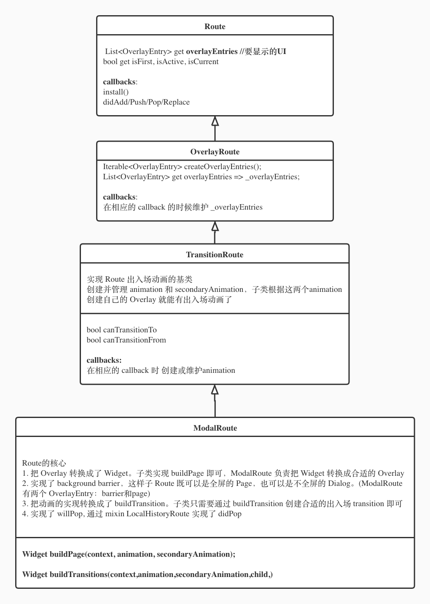

# Navigator 与 Back

在移动端设备上，用户在多个应用或者一个应用的多个页面内切换，给用户提供一个返回的操作能力是最基本的。

传统原因，现在几乎全部 Android 设备都还会提供物理的或者虚拟的返回按键。虽然大多 Android 的定制系统（尤其是国内定制系统）都支持隐藏（甚至默认隐藏）包含着虚拟返回键的虚拟导航栏（Virtual Navigation Bar），但是同时也会提供系统级别的手势返回操作，其功效跟物理的返回按钮完全等同。

在 iOS 设备上，一直是没有系统返回按键的，不管是物理的还是虚拟的。App 只能通过内部 App Bar 上的返回按钮来实现用户回退到上一页面的需求。但是从 iOS 7 以来，iOS 在系统级别上实现了 UIViewController 的侧滑返回(或称为 swipe back)功能，非常的好用上瘾。

在 Flutter 的世界里，是通过 Navigator 与 Route 来进行页面的切换的：Navigator.push 推入一个 Route，Navigator.pop 退出一个 Route。

> 在 Navigator 这个语境下，Route 与页面被认为是一个等价的概念。下面会对两者混用。

那么当用户触发系统的返回事件时（比如点击  Android 的实体返回键或者虚拟返回键），在 Flutter 中如何实现页面的返回呢？

最直接的想法当然就是 Navigator.pop，把顶部 Route 从栈中 pop 出去，露出下面的一个 Route，实现页面返回的效果。

这当然没错，但是需要考虑两个问题：

## 两个问题：

1. 系统的 back 事件是如何被 Flutter App 响应的？
2. 如何拦截系统 Back 事件，做一些 App 内部的业务逻辑处理？

### 如何响应系统的 Back 事件

在 flutter/lib/src/services/system_channels.dart 中定义了一个叫 navigation 的 MethodChannel，这个 channel 就是用来传递原生平台的 back 事件的。

```dart
static const MethodChannel navigation = MethodChannel(
    'flutter/navigation',
    JSONMethodCodec(),
);
```

在 mixin WidgetsBinding 中定义了这个 method channel 的 call handler：

```dart
	void initInstances() {
	  ...
  	SystemChannels.navigation.setMethodCallHandler(_handleNavigationInvocation);
		...
	}

  Future<dynamic> _handleNavigationInvocation(MethodCall methodCall) {
    switch (methodCall.method) {
      case 'popRoute':
        return handlePopRoute();
      case 'pushRoute':
        return handlePushRoute(methodCall.arguments as String);
    }
    return Future<dynamic>.value();
  }
```

在 handlePopRoute 中会通知 WidgetsBinding 中注册 observer

```dart
Future<void> handlePopRoute() async {
  for (final WidgetsBindingObserver observer in List<WidgetsBindingObserver>.from(_observers)) {
    if (await observer.didPopRoute())
      return;
  }
  /// 如果 Flutter App 内没有消费掉 back 时间，那么
  /// Removes the topmost Flutter instance, presenting what was before it.
  /// 在 Android 上就是从 Activity stack 中移除当前 Activity
  /// 在 iOS 上就是 popViewControllerAnimated 或 dismissViewControllerAnimated
  SystemNavigator.pop();
}

  static Future<void> pop({bool animated}) async {
    await SystemChannels.platform.invokeMethod<void>('SystemNavigator.pop', animated);
  }
```

谁往 WidgetsBinding 中注册了 observer 呢？MaterialApp/CupertinoApp 的 child WidgetsApp

在 widgets/app.dart 的 _WidgetsAppState：

```dart
  void initState() {
    super.initState();
    _updateNavigator();
    _locale = _resolveLocales(WidgetsBinding.instance.window.locales, widget.supportedLocales);
    WidgetsBinding.instance.addObserver(this);
  }

  Widget build(BuildContext context) {
    Widget navigator;
    navigator = Navigator(...)
    ...
  }

  // On Android: the user has pressed the back button.
  @override
  Future<bool> didPopRoute() async {
    assert(mounted);
    final NavigatorState navigator = _navigator?.currentState;
    if (navigator == null)
      return false;
    return await navigator.maybePop();
  }        
```

可以看出 WigetsApp 负责了 Navigator 的创建并通知 Navigator 对系统的返回事件进行响应。

### 如何拦截系统 Back 事件

有时候需要拦截 back 事件，做些特殊处理。比如填写表单过程中，比如返回需要做些UI的变化

要想拦截系统的 back 事件，需要先了解 Navigator 处理 back 的流程，从这个流程中找到一个最优的 hook 的点。

## Navigator 的结构

Navigator 是个非常复杂的 Widget（navigator.dart 有 4k+ 行代码），只有了解了 Navigator 的结构才能更好的了解 Navigator 如何处理返回事件。

Navigator 的 Widget 结构如下：


Navigator 用 Overlay 来组织自己的 Route：Navigator 将 Route 的页面信息以 OverlayEntry 的方式插入到自己管理的 Overlay 中。

同时，为了方便管理 Route 的生命周期，Navigator 将 Route 封装到了 _RouteEntry 中。类图视角的结构图如下：


UI 展示上，Navigator 找所有 Route 拿到它们的 overlayEntries，交给 Overlay 去展示。展示的 Widget 是 OverlayEntry 的 builder 生成的 Widget。

Navigator 进行 pop/push 等操作时，会通过 _RouteEntry 传递给 Route，并触发 Route 的 didPop/willPop 等 hook 函数。

## Navigator 如何处理 back

从前面 Flutter 如何响应系统返回事件的讨论可以看出，系统的返回事件最终会传递到 Navigator.maybePop；另外，我们在自己处理页面（Route）的返回时，会直接使用 Navigator.pop。分这两种情况来分析

### Navigator.mayBePop

```dart
Future<bool> maybePop<T extends Object>([ T result ]) async {
  final _RouteEntry lastEntry = _history.lastWhere(_RouteEntry.isPresentPredicate, orElse: () => null);
  if (lastEntry == null) return false;
  final RoutePopDisposition disposition = await lastEntry.route.willPop(); // this is asynchronous
  ...
  switch (disposition) {
    case RoutePopDisposition.bubble:
      return false;
    case RoutePopDisposition.pop:
      pop(result);
      return true;
    case RoutePopDisposition.doNotPop:
      return true;
  }
  return null;
}
```

可以看出在 mayBePop 的时候会先去找 Route 查询 willPop，如果 Route 的 willPop 返回 doNotPop的话，这次 pop 就此被消费掉了。

这里就是我们可以hook的一个点。

如果 Route 的 willPop 返回的是 pop，那么就会开始 Navigator.pop。(如果返回的是 bubble，那么就会往上冒泡，让更上层的消费者来消费这个返回事件)

### Navigator.pop

```dart
void pop<T extends Object>([ T result ]) {
  final _RouteEntry entry = _history.lastWhere(_RouteEntry.isPresentPredicate);
  if (...) {
  } else {
    entry.pop<T>(result);
  }
  if (entry.currentState == _RouteLifecycle.pop) {
    // Flush the history if the route actually wants to be popped (the pop
    // wasn't handled internally).
    _flushHistoryUpdates(rearrangeOverlay: false);
  }
}

// entry.pop
  void pop<T>(T result) {
    doingPop = true;
    if (route.didPop(result) && doingPop) {
      currentState = _RouteLifecycle.pop;
    }
    doingPop = false;
  }
```

这里可以看到，在 Navigator.pop 时，会触发 _RouteEntry.pop，然后就会有一个 route.didPop(result)的判断，如果返回值为 true 才会更改\_RouteEntry的生命周期为 _RouteLifecycle.pop，否则 pop 无效。

didPop 是我们可以用来拦截 back 事件的第二个 hook 点。

到这里，一个 back 事件的处理流程如下：


## 如何拦截 back 事件

现在有两个可以拦截 back 时间的api：Route.didPop 和 Route.willPop

一种方案是直接在项目的 Route 实现中自己实现 dipPop 或 willPop 的逻辑，以达到拦截 back 事件的目的。

但实际上，几乎不会从头实现一个 Route，Flutter framework 中有丰富的 Route可控选择：


看看这些 Routes 里面，哪些可以用来处理 willPop，哪些可以用来处理 didPop

### Route.willPop

ModalRoute 实现了 willPop：

```dart
typedef WillPopCallback = Future<bool> Function();

@override
Future<RoutePopDisposition> willPop() async {
  final _ModalScopeState<T> scope = _scopeKey.currentState;
  assert(scope != null);
  for (final WillPopCallback callback in List<WillPopCallback>.from(_willPopCallbacks)) {
    if (await callback() != true)
      return RoutePopDisposition.doNotPop;
  }
  return await super.willPop();
}
```

可见 ModalRoute 管理了一个 WillPopCallback 的 list，只要往这个 list 里面添加上 WillPopCallback 就可以实现拦截 back 事件。

ModalRoute 提供了满足这些需求的 API：

```dart
static ModalRoute<T> of<T extends Object>(BuildContext context)
void addScopedWillPopCallback(WillPopCallback callback)
void removeScopedWillPopCallback(WillPopCallback callback)
```

当然可以直接使用这些 API 来实现拦截 back 事件做自定义业务处理的效果。但是更优的选择是使用 WillPopScope 这个 Widget。

```dart
class WillPopScope extends StatefulWidget {
  const WillPopScope({
    Key key,
    @required this.child,
    @required this.onWillPop,
  });
  final Widget child;
  final WillPopCallback onWillPop;
}

class _WillPopScopeState extends State<WillPopScope> {
  ModalRoute<dynamic> _route;
  @override
  void didChangeDependencies() {
    super.didChangeDependencies();
    if (widget.onWillPop != null)
      _route?.removeScopedWillPopCallback(widget.onWillPop);
    _route = ModalRoute.of(context);
    if (widget.onWillPop != null)
      _route?.addScopedWillPopCallback(widget.onWillPop);
  }

  @override
  void didUpdateWidget(WillPopScope oldWidget) {
    super.didUpdateWidget(oldWidget);
    if (widget.onWillPop != oldWidget.onWillPop && _route != null) {
      if (oldWidget.onWillPop != null)
        _route.removeScopedWillPopCallback(oldWidget.onWillPop);
      if (widget.onWillPop != null)
        _route.addScopedWillPopCallback(widget.onWillPop);
    }
  }
  @override
  void dispose() {
    if (widget.onWillPop != null)
      _route?.removeScopedWillPopCallback(widget.onWillPop);
    super.dispose();
  }
  @override
  Widget build(BuildContext context) => widget.child;
}
```

使用 WillPopScope 有两个好处：

1. 自动处理了 widget update、dependent update、init、dispose等边界场景，只需实现 WillPopCallback 的逻辑即可；
2. everything is a widget

### Route.didPop

LocalHistoryRoute 实现了 didPop。LocalHistoryRoute 并不直接继承自 Route，它是一个 target 到 Route 的 mixin。ModalRoute 使用了这个 mixin。

```dart
mixin LocalHistoryRoute<T> on Route<T> {
  List<LocalHistoryEntry> _localHistory;
    @override
  bool didPop(T result) {
    if (_localHistory != null && _localHistory.isNotEmpty) {
      final LocalHistoryEntry entry = _localHistory.removeLast();
      entry._owner = null;
      entry._notifyRemoved();
      if (_localHistory.isEmpty)
        changedInternalState();
      return false;
    }
    return super.didPop(result);
  }
  void addLocalHistoryEntry(LocalHistoryEntry entry)
  void removeLocalHistoryEntry(LocalHistoryEntry entry)
}

class LocalHistoryEntry {
  LocalHistoryEntry({ this.onRemove });
  final VoidCallback onRemove;
  void remove() {
    _owner.removeLocalHistoryEntry(this);
  }
  void _notifyRemoved() {
    if (onRemove != null)
      onRemove();
  }
}
```

可见，LocalHistoryRoute + LocalHistoryEntry override didPop 也可以实现 ModalRoute + WillPopCallback  override willPop 的效果

## willPop 对比 didPop

1. willPop 只有 Navigator.maybePop的时候才会触发，Navigator.pop不会触发；

2. willPop 可以使用 WillPopScope 来简化使用；

3. LocalHistoryRoute 在 add/remove LocalHistoryEntry 时可能会触发 setState:

   ```dart
   void addLocalHistoryEntry(LocalHistoryEntry entry) {
     final bool wasEmpty = _localHistory.isEmpty;
     _localHistory.add(entry);
     if (wasEmpty)
       changedInternalState();
   }
   
   void removeLocalHistoryEntry(LocalHistoryEntry entry) {
     _localHistory.remove(entry);
     if (_localHistory.isEmpty) {
       if (SchedulerBinding.instance.schedulerPhase == SchedulerPhase.persistentCallbacks) {
         SchedulerBinding.instance.addPostFrameCallback((Duration duration) {
           changedInternalState();
         });
       } else {
         changedInternalState();
       }
     }
     @override
     void changedInternalState() {
       setState(() { /* internal state already changed */ });
       ...
     }
   ```

   因此，在widget build 的过程中 add/remove LocalHistoryEntry 要慎重，容易触发：

   setState() or markNeedsBuild() called during build.

4. removeLocalHistoryEntry 仍会导致 LocalHistoryEntry 中 onRemove 被调用。

## 几个问题

### BasePageState 存在的问题

1. 不能 add 多个 LocalHistoryEntry

   ```dart
   void addPageHistoryEntry(BuildContext context, VoidCallback onRemove) {
     if (_pageHistoryEntry == null) {
       _shouldCallOnRemove = true;
       _pageHistoryEntry = PageHistoryEntry(
         onRemove: () {
           if (_shouldCallOnRemove) onRemove.call();
           _pageHistoryEntry = null;
         },
       );
       _pageHistoryEntry.addLocalHistoryEntry(context);
     }
   }
   ```

2. 不能在 build 流程中 add

   因此， 在 onResume 中不能直接 add LocalHistoryEntry。

3. postFrame 回来后 context 可能已经被回收

   这是一个结构性的问题，不好修复。

4. popUntil 的时候不好处理

### 超时登出报错，popUntil 不报错的原因

#### 现象：

停在 LoanHomeConfirmPage 等待长时间未操作自动登出触发 popUntil(Home)，报错

The method 'addLocalHistoryEntry' was called on null.

但是，直接 LoanHomeConfirmPage 直接触发 popUntil(Home) 不报错

#### 原因：

``` dart
@override
void onResume() {
  super.onResume();
  addPageHistoryEntryPostFrame(() {
    CouponUtils.saveSelectedCoupon(Dispatcher.store(context), couponList: []);
    Router.pageBack(context);
  }, postFrame: true);
```

LoanHomeConfirmPage 是嵌在 LoanHomePage 中的，LoanHomePage 才是 Route 的页面。

在超时登出 popUntil 之前，把 Redux Store 都重新初始化了，因此在 postFrame 的这个 frame 过程中，嵌套的 LoanHomeConfirmPage 就会被 deactive 然后 dispose，当 build 的这一帧完成时 (post frame)，LoanHomeConfirmPage 的 context已经从Element tree中删除了。

这是再去执行 onRemove 中的代码，其中 context 就是 null 了。

但是，如果直接 popUntil(Home)，postFrame 回来后 LoanHomeConfirmPage 的 context 一直在 Element tree 中。

### iOS 侧滑返回的实现，如何在 Android 实现侧滑返回

通过 CupertinoPageRoute 实现。

在 Android 上实际上也是支持侧滑返回的，只不过在 MIUI 设备上默认的手势返回操作抢占了侧滑返回手势的消费。

### 一点改进

项目中使用的最多的 Route 是 CupertinoPageRoute，当给 CupertinoPageRoute 添加上 WillPopCallback 或 LocalHistoryEntry 后，侧滑返回手势失效了。原因是在 CupertinoPageRoute 中：

```dart
static bool _isPopGestureEnabled<T>(PageRoute<T> route) {
  // If there's nothing to go back to, then obviously we don't support
  // the back gesture.
  if (route.isFirst)
    return false;
  // If the route wouldn't actually pop if we popped it, then the gesture
  // would be really confusing (or would skip internal routes), so disallow it.
  if (route.willHandlePopInternally)
    return false;
  // If attempts to dismiss this route might be vetoed such as in a page
  // with forms, then do not allow the user to dismiss the route with a swipe.
  if (route.hasScopedWillPopCallback)
    return false;
  // Fullscreen dialogs aren't dismissible by back swipe.
  if (route.fullscreenDialog)
    return false;
  // If we're in an animation already, we cannot be manually swiped.
  if (route.animation.status != AnimationStatus.completed)
    return false;
  // If we're being popped into, we also cannot be swiped until the pop above
  // it completes. This translates to our secondary animation being
  // dismissed.
  if (route.secondaryAnimation.status != AnimationStatus.dismissed)
    return false;
  // If we're in a gesture already, we cannot start another.
  if (isPopGestureInProgress(route))
    return false;

  // Looks like a back gesture would be welcome!
  return true;
}
```

如果能在这种情况下不是简单的禁用返回动画，而是给一个稍微拖动一点的动画，效果可能会更好。

在 Android 的设备上，如果把 swipe gesture 的触控区域离开边缘一点，不要跟系统的侧滑返回手势区域重叠，那么也是可以打开侧滑返回的。


# CupertinoPageRoute 动画和手势

## 再看基类 Routes

再看看 Route 的继承关系及各个 Route 的作用：



可以看出，要想实现一个 ModalRoute 的 UI，只需要实现 buildPage，要想实现出入场动画，只需实现 buildTransitions

## CupertinoPageRoute 如何实现 UI 和 动画

看看 CupertinoPageRoute 这个 ModalRoute 是如何通过实现这两个方法来实现相应的功能的

```dart
class CupertinoPageRoute<T> extends PageRoute<T> with CupertinoRouteTransitionMixin<T> {
  final WidgetBuilder builder;
}
```

CupertinoPageRoute 的主要功能都是通过 CupertinoRouteTransitionMixin 实现的。

```dart
@override
Widget buildPage(BuildContext context, Animation<double> animation, Animation<double> secondaryAnimation) {
  final Widget child = builder(context);
  final Widget result = Semantics(
    scopesRoute: true,
    explicitChildNodes: true,
    child: child,
  );
  return result;
}
  @override
  Widget buildTransitions(BuildContext context, Animation<double> animation, Animation<double> secondaryAnimation, Widget child) {
    return buildPageTransitions<T>(this, context, animation, secondaryAnimation, child);
  }

  static Widget buildPageTransitions<T>(
    PageRoute<T> route,
    BuildContext context,
    Animation<double> animation,
    Animation<double> secondaryAnimation,
    Widget child,
  ) {
    // linear 的意思是是否线性的响应 animation 的变化
    // TransitionRoute 生成、维护的两个 animation 的 Curve 是线性的。
    // CupertinoPageRoute 在做出入场动画时为了更好看，肯定加了 Curve 的。
    // 但是如果是响应手势的拖动时，就不能加 Curve，这就是这里 linear 的意思
    final bool linearTransition = isPopGestureInProgress(route);
    if (route.fullscreenDialog) {
      // 有兴趣可以分析下这里有没有有意思的事情
    } else {
      return CupertinoPageTransition(
        primaryRouteAnimation: animation,
        secondaryRouteAnimation: secondaryAnimation,
        linearTransition: linearTransition,
        // 这里就是 swipe gesture 的实现，稍后再说
        child: _CupertinoBackGestureDetector<T>(
          enabledCallback: () => _isPopGestureEnabled<T>(route),
          onStartPopGesture: () => _startPopGesture<T>(route),
          child: child,
        ),
      );
    }
  }

class CupertinoPageTransition extends StatelessWidget {
  // 就是在这里实现一个完全 iOS 风格的出入场动画：
  // _primaryPositionAnimation 是顶层 Route 的出入场动画
  // _secondaryPositionAnimation 是下面一层 Route 的随动动画
  // _primaryShadowAnimation 是顶层 Route 在出入场时阴影的动画
  CupertinoPageTransition({
    Key key,
    @required Animation<double> primaryRouteAnimation,
    @required Animation<double> secondaryRouteAnimation,
    @required this.child,
    @required bool linearTransition,
  }) : assert(linearTransition != null),
       _primaryPositionAnimation =
           (linearTransition
             ? primaryRouteAnimation
             : CurvedAnimation(
                 parent: primaryRouteAnimation,
                 curve: Curves.linearToEaseOut,
                 reverseCurve: Curves.easeInToLinear,
               )
           ).drive(_kRightMiddleTween),
       _secondaryPositionAnimation =
           (linearTransition
             ? secondaryRouteAnimation
             : CurvedAnimation(
                 parent: secondaryRouteAnimation,
                 curve: Curves.linearToEaseOut,
                 reverseCurve: Curves.easeInToLinear,
               )
           ).drive(_kMiddleLeftTween),
       _primaryShadowAnimation =
           (linearTransition
             ? primaryRouteAnimation
             : CurvedAnimation(
                 parent: primaryRouteAnimation,
                 curve: Curves.linearToEaseOut,
               )
           ).drive(_kGradientShadowTween),
       super(key: key);

  final Animation<Offset> _primaryPositionAnimation;
  final Animation<Offset> _secondaryPositionAnimation;
  final Animation<Decoration> _primaryShadowAnimation;
  
  final Widget child;

  @override
  Widget build(BuildContext context) {
    assert(debugCheckHasDirectionality(context));
    final TextDirection textDirection = Directionality.of(context);
    return SlideTransition(
      position: _secondaryPositionAnimation,
      textDirection: textDirection,
      transformHitTests: false,
      child: SlideTransition(
        position: _primaryPositionAnimation,
        textDirection: textDirection,
        child: DecoratedBoxTransition(
          decoration: _primaryShadowAnimation,
          child: child,
        ),
      ),
    );
  }
}
```

有了前面一系列 Routes 的铺垫，实现一个 iOS 风格的页面出入场动画并不是很复杂。

## CupertinoPageRoute 如何实现 swipe back

下面看看 swipe gesture 是如何实现的。

如前面的代码，CupertinoRouteTransitionMixin 在 buildTransition 时出入的 child 是这个：

```dart
_CupertinoBackGestureDetector<T>(
          enabledCallback: () => _isPopGestureEnabled<T>(route),
          onStartPopGesture: () => _startPopGesture<T>(route),
          child: child,
),
```

看看这个 _CupertinoBackGestureDetector：

```dart
class _CupertinoBackGestureDetector<T> extends StatefulWidget {
  const _CupertinoBackGestureDetector({
    Key key,
    @required this.enabledCallback, // ValueGetter<bool> enabledCallback;
    @required this.onStartPopGesture, // ValueGetter<_CupertinoBackGestureController<T>> onStartPopGesture;
    @required this.child,  // Widget child;
  });
}

class _CupertinoBackGestureDetectorState<T> extends State<_CupertinoBackGestureDetector<T>> {
  // 手势数据的 处理器
  _CupertinoBackGestureController<T> _backGestureController;
	// swipe back 手势的识别器
  HorizontalDragGestureRecognizer _recognizer;
  @override
  void initState() {
    super.initState();
    // 注册 swipe back 手势识别器的回调
    _recognizer = HorizontalDragGestureRecognizer(debugOwner: this)
      ..onStart = _handleDragStart
      ..onUpdate = _handleDragUpdate
      ..onEnd = _handleDragEnd
      ..onCancel = _handleDragCancel;
  }


  void _handleDragStart(DragStartDetails details) {
    /// 手势识别到了，创建 处理器
    _backGestureController = widget.onStartPopGesture();
  }

  void _handleDragUpdate(DragUpdateDetails details) {
    double primaryDelta = _convertToLogical(details.primaryDelta / context.size.width);
    // drag 手势数据更新，交给 处理器处理
    _backGestureController.dragUpdate(primaryDelta);
  }

  void _handleDragEnd(DragEndDetails details) {
    /// 告诉 手势数据处理器 拖动结束了，并不再引用手势数据处理器
    _backGestureController.dragEnd();
    _backGestureController = null;
  }
  
  void _handleDragCancel() {
    // 同 _handleDragEnd
    _backGestureController?.dragEnd(0.0, totalPrimaryDelta);
    _backGestureController = null;
  }

  void _handlePointerDown(PointerDownEvent event) {
    if (widget.enabledCallback())
      // 当一个触屏点检测到的时候，告诉 手势识别器 开始追踪识别
      _recognizer.addPointer(event);
  }

  @override
  Widget build(BuildContext context) {
    return Stack(
      fit: StackFit.passthrough,
      children: <Widget>[
        widget.child,
        PositionedDirectional(
          // 通过 Listener 追踪 触屏手势
          child: Listener(
            onPointerDown: _handlePointerDown,
            behavior: HitTestBehavior.translucent,
          ),
        ),
      ],
    );
  }
}
```

整个流程比较简单：用 Listener 监听触屏事件(PointerDownEvent)，然后把 PointerDownEvent 交给手势识别器HorizontalDragGestureRecognizer 去跟踪处理，HorizontalDragGestureRecognizer 在跟踪的过程中不停的触发回调，告知监听者手势数据的变化（手势开始了、移动了多少距离，是否结束，是否取消），监听者拿到这些数据后交给 手势数据处理器 _backGestureController 进行处理。

HorizontalDragGestureRecognizer 手势识别是另外一个比较复杂的 topic，这里不做深入。我们只是简单知道他可以识别水平的滑动手势，并在手势变化的时候发出回到。

现在看看手势数据处理器 _backGestureController 是如何把手势数据转换成 UI 上的变化的：

_backGestureController 是一个 _CupertinoBackGestureController：

```dart
class _CupertinoBackGestureController<T> {
  _CupertinoBackGestureController({
    @required this.navigator,
    @required this.controller,
  });
  // 持有 TransitionRoute 的 AnimationController，通过它控制 animation 的 value，以变化 UI 响应手势。（完）
  final AnimationController controller;
  // 满足条件的时候做 pop
  final NavigatorState navigator;

  void dragUpdate(double delta) {
      controller.value -= delta;
  }
  void dragEnd(double velocity) {
    bool animateForward;
    if (velocity.abs() >= _kMinFlingVelocity)
      animateForward = velocity <= 0;
    else
      animateForward = controller.value > 0.5;

    if (animateForward) {
      // 退回原位
      controller.animateTo(1.0, ...);
    } else {
      // 手势到位了，pop，pop 只会把 Route 的生命周期短暂的置为 pop，动画完成了 Route 才会走完自己生命周期
      // 参考文雄上次 Navigator 的培训
      navigator.pop();
      if (controller.isAnimating) {
        /// 把剩下的退场动画完成
        controller.animateBack(0.0, ...);
      }
    }
    ...
  }
}
```

swipe back 的实现就是这样的。